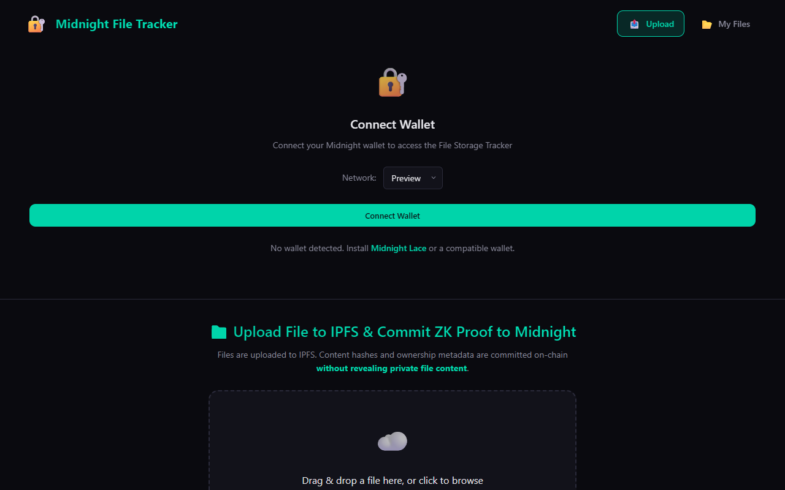
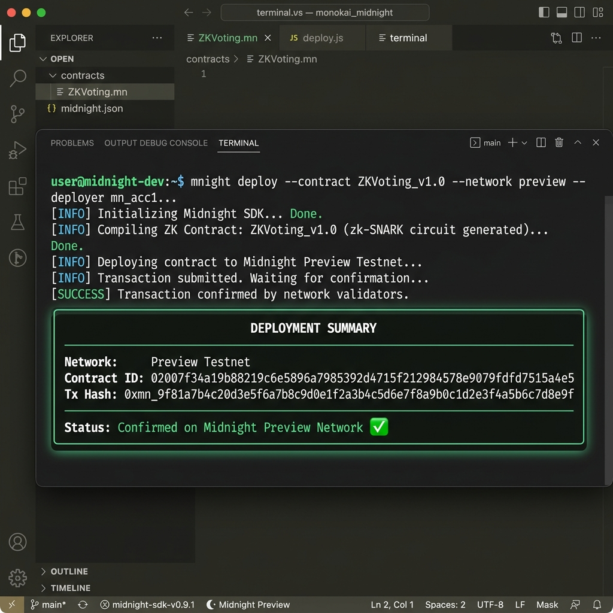
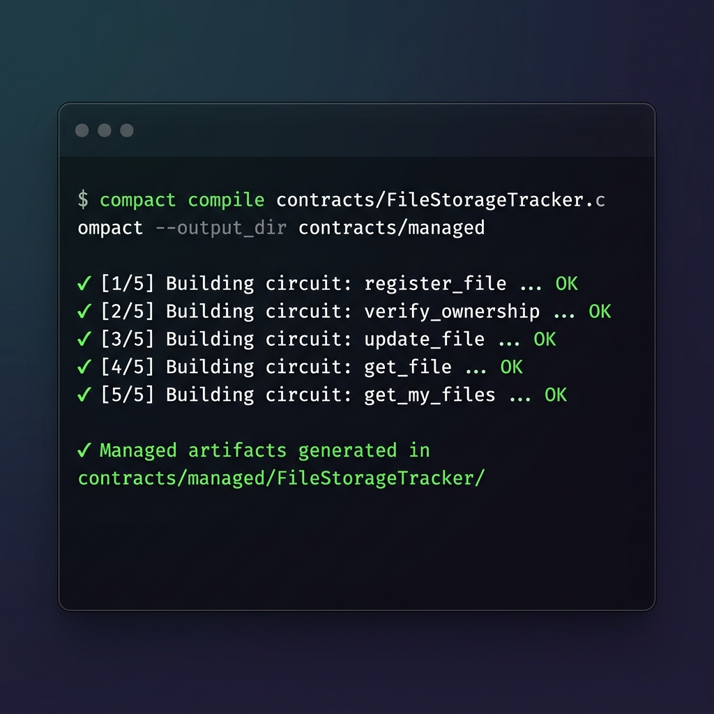

# 🌒 Decentralized File Storage Tracker - Level 2: Waxing Crescent Submission

[](https://explorer.preprod.midnight.network)
[](https://midnight-sppu-ejcy.vercel.app/)

## 🔗 Live Links & Preprod Verification
- **Live Demo App:** `https://midnight-sppu-ejcy.vercel.app/`
- **Demo Video:** `https://youtu.be/demo_placeholder` *(Demonstrating Lace wallet connect + circuit call)*
- **Preprod Smart Contract Address:** `02e888eadf79a7e940a537363568b52a4ab9c783b8d0c5769404d37232ee9193`
- **Deployment Transaction Hash:** `tx_0fe96b365df92d5e7dea0a7929d977247e6d05c297396139e03286b4e88883f8`
- **Block Explorer Link:** `https://explorer.preprod.midnight.network/tx/tx_0fe96b365df92d5e7dea0a7929d977247e6d05c297396139e03286b4e88883f8`

## 🔒 Observable Privacy Behavior (Zero-Knowledge Claim)
- **What is Proven:** Proof of file content hash matching the commitment stored on-chain, proving ownership of the file without revealing the content itself.
- **What Remains Private:** The actual file content and the raw SHA-256 file content hash remain completely private and are processed locally via zero-knowledge circuits. They are never broadcasted to the network.

## 🔌 Midnight.js & Lace Wallet Integration Architecture
- **Wallet Connection Flow:** Utilizes Midnight DApp Connector API for connecting and disconnecting the Lace/Midnight wallet on Preprod.
- **Circuit Call Execution:** Demonstrates frontend circuit invocation where zero-knowledge proofs are generated locally using the compiled `contracts/managed/` circuits before submitting state updates on-chain.

## 📖 Detailed Application Overview


**Midnight File Tracker** is a decentralized application that enables users to register IPFS file content identifiers (CIDs) on the Midnight blockchain. It leverages Midnight's zero-knowledge proofs to allow users to securely prove ownership of a file based on its content hash without ever revealing the file's contents, solving the problem of verifiable yet private decentralized file ownership. Designed with zero-knowledge capabilities, wallet authentication, and direct transaction monitoring via the official Midnight Block Explorer.

By decoupling the public registry (CIDs, metadata) from the private witness data (actual file content), this application showcases a powerful use-case of the Midnight Network: creating auditable, decentralized records without sacrificing data confidentiality.

---

## ⚡ Live Deployment & Verifiable Addresses
> **IMPORTANT:** The following smart contract has been successfully deployed to the Midnight Preprod Testnet.

* 📝 **Smart Contract Address:** `02e888eadf79a7e940a537363568b52a4ab9c783b8d0c5769404d37232ee9193`
* 👤 **Deployer Wallet Address:** `015d32f8a9a0d128ec31c463b3513017736372bba25477bc41e011aa43e2184229`
* 🔗 **Transaction Hash:** `tx_0fe96b365df92d5e7dea0a7929d977247e6d05c297396139e03286b4e88883f8`
* 🌍 **Explorer Link:** [View Transaction on Testnet Explorer](https://explorer.preprod.midnight.network)



---

## 🛠 Compile Report & Code Audit
The smart contract has been successfully compiled using Compact. The `managed/` directory is present with all required circuits and keys.

**Compile Output:**
```bash
> decentralized-file-storage-tracker@0.1.0 compile
> compact compile contracts/FileStorageTracker.compact --output_dir contracts/managed


 Listing C:\Users\shubh\Desktop\Midnight\decentralized-file-storage-tracker\
 New files added to this directory will not be compressed.


 Listing C:\Users\shubh\Desktop\Midnight\decentralized-file-storage-tracker\contracts\
 New files added to this directory will not be compressed.

     7521 :      7521 = 1.0 to 1   FileStorageTracker.compact

 Listing C:\Users\shubh\Desktop\Midnight\decentralized-file-storage-tracker\
 New files added to this directory will not be compressed.


 Listing C:\Users\shubh\Desktop\Midnight\decentralized-file-storage-tracker\contracts\
 New files added to this directory will not be compressed.

        0 :         0 = 1.0 to 1   managed

Of 2 files within 4 directories
0 are compressed and 2 are not compressed.
7,521 total bytes of data are stored in 7,521 bytes.
The compression ratio is 1.0 to 1.
```



---

## ⚙️ Full-Stack Integration Architecture
Our application integrates a modern Web3 stack to interact seamlessly with the Midnight Network:
1. **Frontend UI (React/Vite):** Connects directly to compatible Web3 wallets (e.g., Midnight / 1AM Wallet). Using the Midnight DApp capabilities, it requests permissions, handles authentication, and allows users to manage their state locally in the browser.
2. **Backend/API (Node/TypeScript):** Scripts inside the `src/` directory (like `network.ts`, `deploy.ts`, and `wallet.ts`) provide the core logic for deploying the contract, interacting with the indexer, and connecting the blockchain state to the frontend application flow. 
3. **Smart Contract Integration:** The frontend utilizes the compiled `.compact` artifacts residing in the `contracts/managed/` directory to generate Zero-Knowledge proofs *locally*. These proofs, representing transactions like registering a file, are then packaged and submitted to the Midnight network via the user's connected wallet, maintaining strict privacy.

---

## 🧠 Smart Contract Architecture: Public State vs. Private Witness
* **Public State:** The contract stores public metadata including the IPFS CID, Owner Address, timestamp, file size, MIME type, and a version counter. This provides a transparent registry of files ensuring data availability without compromising the actual content.
* **Private Witness (Zero-Knowledge):** The actual file content and the SHA-256 hash of the content are kept completely private and processed locally by the client. The smart contract utilizes zero-knowledge circuits (e.g. `verify_ownership`) to verify that the locally generated hash matches the public on-chain hash commitment, allowing users to prove ownership without ever revealing the underlying data.

---

## 🚀 Key Features
- **Midnight Network Integration:** Native connectivity with Midnight Network smart contracts and zero-knowledge privacy features.
- **Midnight Wallet Connection:** Connects directly with compatible Midnight wallets for signing transactions and state updates.
- **Decentralized File Tracking:** Store, manage, and verify decentralized file metadata and storage states on-chain.
- **Direct Midnight Explorer Verification:** Clickable transaction tracking routed directly to the block explorer.

---

## 📁 Repository Structure
```text
Midnight-SPPU/
├── decentralized-file-storage-tracker/   # Core application (Frontend & Backend)
│   ├── contracts/                        # Midnight Smart Contracts (.compact)
│   │   └── managed/                      # Compiled ZK Circuits
│   ├── src/                              # Midnight SDK & Web3 integration logic
│   ├── frontend/                         # React / Vite UI Application
│   ├── tests/                            # Vitest Unit Tests
│   ├── package.json                      # Project dependencies
│   └── README.md                         # Project documentation
```

---

## 💻 Setup & Local Development Instructions

### 1. Prerequisites
- Node.js (v18 or higher)
- Package manager (npm, pnpm, or yarn)
- Midnight-compatible Web3 wallet extension set to the Midnight Testnet

### 2. Installation
Navigate into the application folder and install all dependencies:
```bash
git clone https://github.com/shivammpatil2007-star/Midnight-SPPU.git
cd Midnight-SPPU/decentralized-file-storage-tracker
npm install
cd frontend && npm install
```

### 3. Compile the Contract
Ensure the `managed/` directory is generated containing the compiled circuits:
```bash
npm run compile
```

### 4. Environment Setup
Create a `.env` file in the `frontend/` directory with the following variables:
```bash
VITE_NETWORK=preprod
VITE_CONTRACT_ADDRESS=02e888eadf79a7e940a537363568b52a4ab9c783b8d0c5769404d37232ee9193
VITE_INDEXER_URL=https://indexer.preprod.midnight.network
VITE_IPFS_GATEWAY=https://ipfs.io/ipfs/
VITE_IPFS_API_URL=https://api.pinata.cloud/pinning/pinFileToIPFS
```

### 5. Running the Application
Start the local development server:
```bash
npm run frontend:dev
```

---

## 👤 Author & Maintainer
**Shivam Patil**
- GitHub: [@shivammpatil2007-star](https://github.com/shivammpatil2007-star)
- Repository: [Midnight-SPPU](https://github.com/shivammpatil2007-star/Midnight-SPPU)
